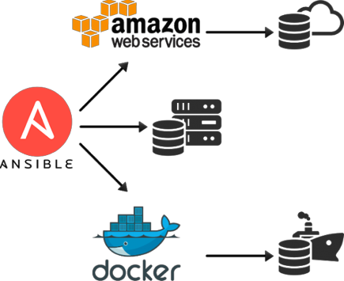
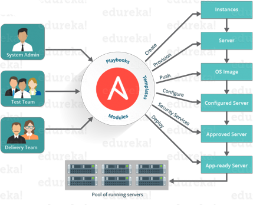
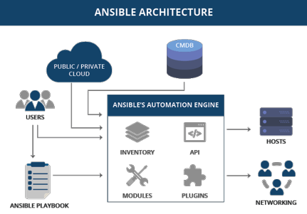
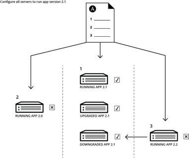
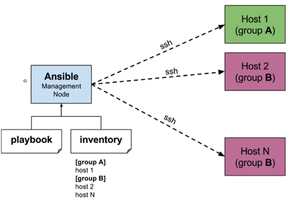
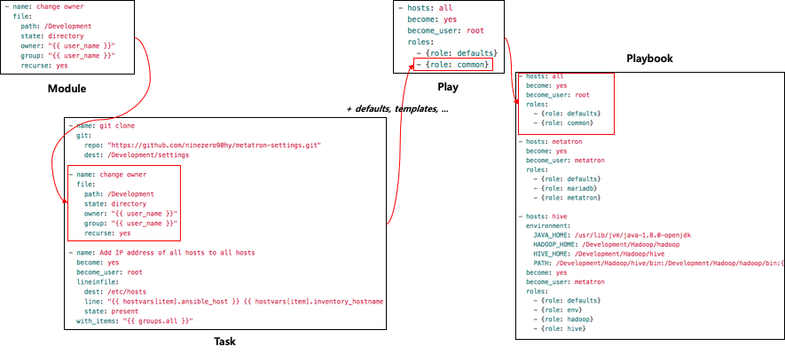
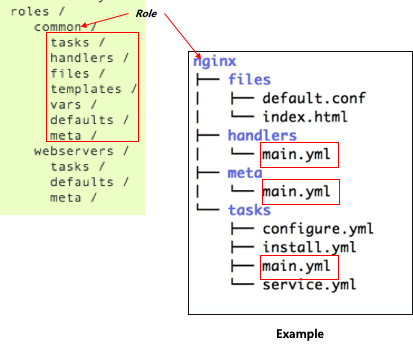

# Ansible Seminar

# ***Ansible이란?***

## **Ansible is an open source for automation that can help realize DevOps, Provision.**

- Apache Top Project, Python Github Top Project
- Provision & Configuration management tool

## **The developing language of Ansible is Python and the definition for implementation uses YAML.**

- Agent-less does not require agent such as client program to be installed on the target host
- Most host accessible by SSH can execute task defined as Ansible
- Because the default definition is in YAML format, it can be described relatively simply compared to other provisioning tools.
- Available modules and documents exist because they have been in use for many years.
- Power equivalence can be secured. (IDempotence: The same result can be obtained by performing the same operation several times.)
- You can also configure many modules and run only individual modules (Ad-hoc)

# ***Why Ansible?***

- Complexity reduces productivity.
   - For development-oriented companies like ours, there are things that are not familiar but happen repeatedly, such as Java installation, DB installation and setup, environment variable setting, OS setting, etc.This leads to productivity degradation for development, which is the main purpose.
    - Ansible can automate these many manual, complex, and repetitive tasks and refine DevOps and Provision in development.
- positive influence
   - Save time and increase productivity
    - Eliminate repetitive tasks
    - Reduce errors and errors
    - Improving collaboration and job satisfaction

    

    # ***Examples of Ansible Use***

    - Provisioning
        - Automating infrastructure provisioning is the first step in automating the application life cycle, which can include nearly all aspects of infrastructure, such as connectivity, installation, setup, patches, and so on to bare metal, virtualized Host and Hypervisor, network, etc.
    - Ex )
        - Add user to Host
        - yum update of CentOS
        - install unzip, git, wget, JDK
        - Set JAVA_HOME to environment variable
        - Create the required directory
        - Copying, distributing, etc. files required

    

    # ***Configuration management***

   - Most related industries or teams have specific administrators to manage the system using a series of scripts or case-specific responses.
    - This is dependent on a particular person or another framework, resulting in a lot of time and risk for maintenance.
    - In addition, recent virtualization/cloud technologies have increased the number of systems and the resulting complexity of the system.
    - Ansible is the simplest solution for available configuration management, designed to provide very low, natural, consistent, secure, and high reliability learning curves for administrators, developers, and IT managers.All we need is YAML and SSH.

    

    # ***Application deployment***

    - A common framework enables reliable and consistent deployment of multiple layers of applications.
    - You can configure services as needed as well as simple applications.
    - Build, Deploy, and even start/stop for WAS can be configured as a module to run the whole or run only part of it.
    - If you use a container-based platform such as Docker, you can adjust the scale for the Container.

    

    # ***Ansible structure***

    ## ***The basic elements are YAML, Playbook, and Inventory.***

    - **YAML** :
        - Types and methods of definitions of Ansible
    - **Playbook** :
        - The collection of Task to be performed.
        - From small to Module -> Role -> Playbook.
        - One execution unit (such as cp, mv) is modulated,
        - Role that includes Task, which is a bundle of modules, and other elements,
        - Play the units in which the defined role is placed and grouped according to the business,
        - Playbook where you can list the plays and give them an order of execution
    - **Inventory** :
        - Definition of what the Playbook should do.
        - Declare global variables from SSH access methods
        You can also group targets and define dependencies.

    

    # ***Relationships between Module, Role, Play, Playbook***

    

    - **Components and Structure of the Role**
        - One role has a basic component and structure.
        - Design and implement accordingly.
    - **defaults** : Basic variables
    - **meta** : Dependency on individual rolls
    - **tasks** : Action to be executed
    - **files** : Files intended to be distributed to the destination
    - **templates** : Template to use (Jinja2)
    - **handlers** : Enable call (event) from other rolls
    - **vars** : Another variable

    

    ***The default, meta, tasks, handlers, and main.yml in the meta folder are to be executed.***

    # ***Demo***

    - Installation type
        - MariaDB
        - Hadoop
        - Hive
        - Druid
        - Metatron 3.0
    - Install To (OpenStack in-house)
        - node1 : MariaDB, Metatron 3.0
        - node2 : Hadoop, Hive
        - node3 : Druid
    - ***A total of three virtual machines. Clustering is not considered.***

    ## ***Metatron 3.0 Installation Automation Execution Scenario***

    

    ## ***Ansible Project Git Storage***

    - https://github.com/ninezero90hy/metansible

    # ***Thank you very much. :)***
